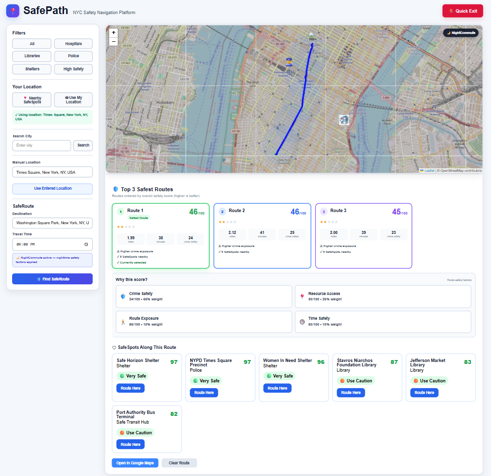
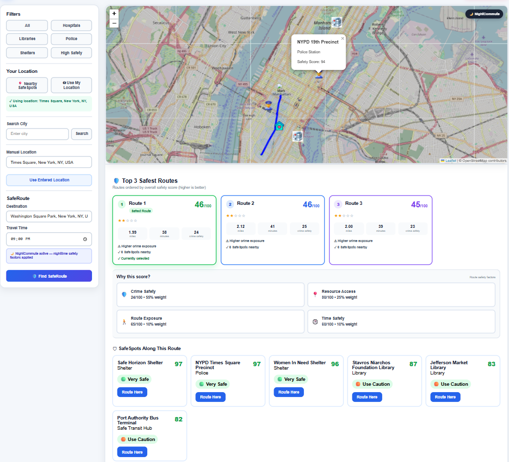

# SafePath

SafePath is a full stack safety focused navigation application that helps users compare routes based on safety, distance, and travel time instead of optimizing only for the fastest route.

Users can generate multiple route options, compare safety scores, locate nearby SafeSpots such as hospitals, police stations, shelters, and libraries, and explore everything through an interactive map.

## Demo

### Route Comparison



### SafeSpots



## Features

SafePath allows users to:

* Enter a starting location and destination
* Generate multiple route options
* Compare routes by safety score, distance, and estimated travel time
* View nearby SafeSpots such as hospitals, police stations, shelters, and libraries
* Use browser geolocation to detect current location
* Filter SafeSpots by category
* Sort and compare route options
* View routes and safety resources on an interactive map

## Tech Stack

### Frontend

* React
* JavaScript
* Leaflet

### Backend

* Java
* Spring Boot
* H2 Database

### APIs and Services

* OpenRouteService

## How SafePath Works

SafePath uses a React frontend connected to a Spring Boot backend.

When a user enters an origin and destination, the frontend sends the request to the backend.

The backend communicates with OpenRouteService to retrieve multiple possible route options. SafePath then processes the route data and applies safety related logic to generate a safety score for each route.

The processed results are returned to the frontend, where users can compare routes based on safety score, distance, and travel time.

Leaflet is used to display the routes and nearby SafeSpots on an interactive map.

## What I Built

I designed and implemented SafePath as a full stack project.

My work included:

* Building REST endpoints with Spring Boot
* Integrating OpenRouteService for routing data
* Processing geographic and route data
* Developing route safety scoring logic
* Building the React frontend
* Integrating Leaflet for interactive mapping
* Implementing browser geolocation
* Building SafeSpot filtering and visualization
* Handling frontend and backend communication
* Debugging API, geocoding, state management, and integration issues

## Technical Challenges

One of the biggest challenges was coordinating data across the external routing API, Spring Boot backend, and React frontend.

Route data had to be transformed into a format that could be scored, compared, and correctly displayed on the map.

I also worked through issues involving:

* Failed API responses
* Geocoding errors
* Frontend state management
* Map rendering
* Backend and frontend integration
* Handling route data consistently across the application

Building SafePath gave me experience debugging problems across an entire full stack system rather than working on only one isolated component.

## Project Structure

A typical project structure looks like this:

```text
SafePath/
│
├── src/
│   └── main/
│       └── java/
│
├── frontend/
│   ├── src/
│   ├── public/
│   └── package.json
│
├── pom.xml
├── mvnw
├── mvnw.cmd
└── README.md